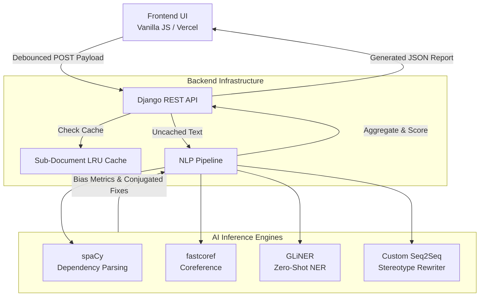

# System Architecture

Neutral Net is built on a **Stateless, Decoupled Architecture**. By strictly separating the client-side user interface from inference engines, the system achieves high scalability, fast UI response times and absolute data privacy.

This document provides a high-level overview of how data flows through the system. For deep dives into specific parts of the system, please refer to `frontend.md`, `backend.md` and `api.md`.

## System Flowchart

## 1. Core Nodes

### Node 1: The Client (Vercel)
The frontend acts as a lightweight text editor. It is responsible for state management, UI rendering and capturing user inputs.

* **No Data Storage:** User preferences, such as words explicitly chosen to ignore are stored in the browser's local memory and passed to the backend dynamically.
* **Debouncing:** Uses debounding and stale state management to ensure the backend is only queried when the user pauses, and responses are discarded if the input changes before the server replies.

### Node 2: The API (Django)
Django serves as the bridge between the web and the NLP models.
* **Stateless Design:** To maximize speed and privacy, Neutral Net does not store any data in databases or such. Everything is stored strictly in the browser's memory, and is instantly destroyed afterward.
* **Sub-Document Caching:** Caches individual sentences using an LRU (Least Recently Used) cache. If a user modifies a single sentence in a long paragraph, only the sentence is reprocessed. This reduces latency by over 80%.

### Node 3: The ML Engine (Transformers / Pytorch)
Consists of many different models. Coordinate safe zones are used to ensure the models do not try to overwrite each other
* **spacy:** Used for dependency parsing
* **GLiNER:** Zero-Shot Named Entity Recognition
* **Sequence Classification Model:** Finds the probability of a sentence-level bias in sentences.
* **Seq2Seq Model (Fine Tuned):** Provides grammar-aware reasoning and rewrites for sentence-level biases.
* **fastcoref:** Maps pronouns to the nominal subject
* **Distilroberta:** Provides neutral synonyms for effective replacements.
* **Deberta-v3:** NLI Model that distinguishes whether a gendered term refers to a specific, real person or a generic role

## 2. The Lifecycle of a Request
1. **Trigger and Debounce:** When a user types in text, the frontend intercepts the input, but passes them to the backend only after the user has stopped typing for 500 ms.
2. **JSON Generation:** The frontend generates a JSON report containing details about the user's `ignored_texts` and the overall input.
3. **Request:** A POST request is fired to the REST API
4. **Cache Validation:** The Django backend splits the incoming text into sentences. It checks the cache to see if any of these sentences have been processed before.
5. **Inference:** All uncached sentences are sent to the ML engines, for bias detection and analysis.
6. **Scoring and Response:** The score is calculated using an exponential decay function. The backend returns a JSON object containing the score, bias objects and the final safe HTML string.
7. **Stale State Check and Rendering:** Incase the user hasn't updated the input since the backend has received it, it instantly updates the DOM with the new HTML string, and updates the radar chart and the score dashboard.